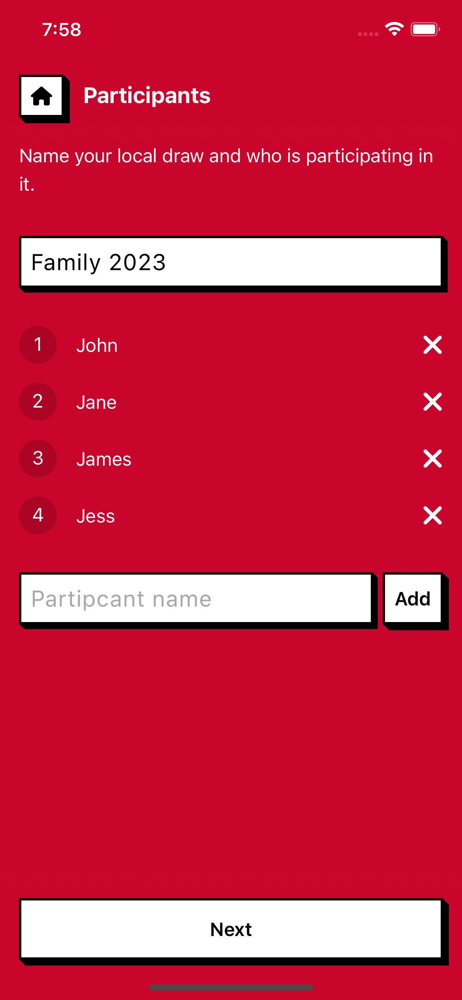
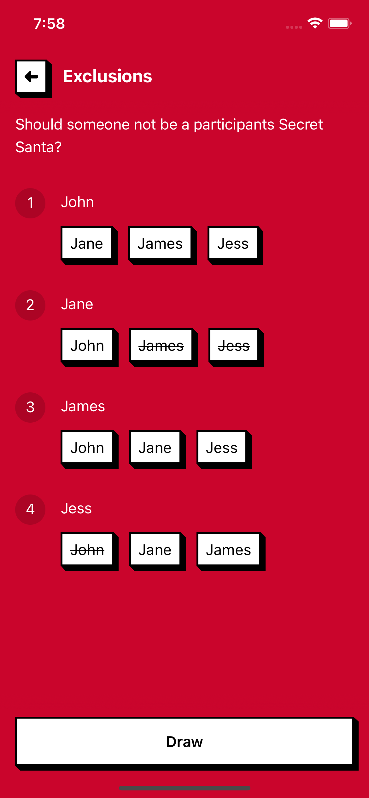
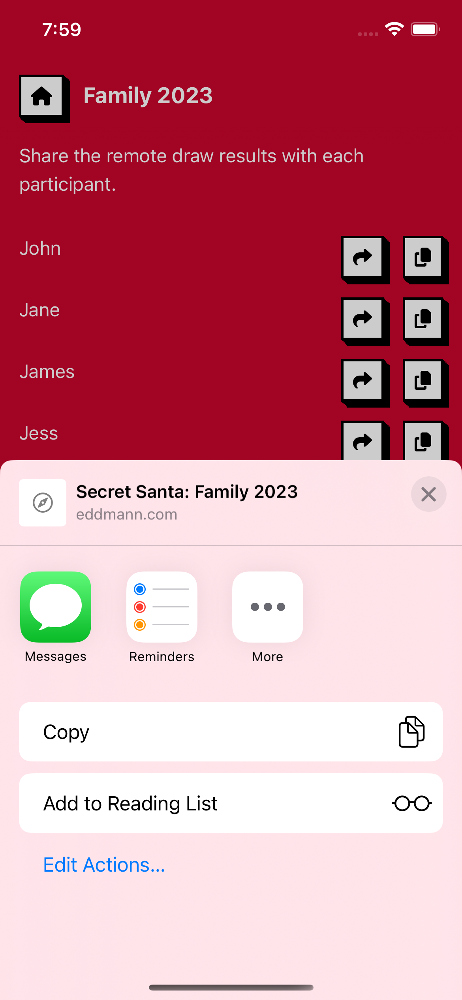

# Secret Santa PWA

_Carry out local and remote Secret Santa draws with your friends and family_

The application has been built using the following technologies:

- React
- TypeScript
- CSS-in-JS (styled-components)
- Vite

## Application

Progress Web Application (PWA) which allows you to carry out local and remote Secret Santa draws on iOS, Android and Desktop.

### Local

Local draws are carried out and presented on the same device.
Once the draw has been completed, each allocation is presented one after another with the device being passed around to each requested participant until everyone knows who they are Secret Santa for.

### Remote

Remote draws are carried out on a single device with the resulting allocations being shared with each participant via an encrypted URL (using the [Web Share API](https://developer.mozilla.org/en-US/docs/Web/API/Web_Share_API)).
When the encrypted URL is visited the participant is presented with a similar screen to a Local draw, where they can reveal who they are Secret Santa for.
Being encrypted the user of the device who completed the draw (and tasked with sharing the results) is unable to snoop on each allocation.
As all state about the allocation is stored with the URL there is no need for remote state persistence, and the application can remain a simple SPA deployed on [GitHub Actions](.github/workflows/release.yml).

### History

Each draw is persisted locally on the device using the [Web Storage API](https://developer.mozilla.org/en-US/docs/Web/API/Web_Storage_API).
This allows the user to retrieve the results again after the draw has taken place.
Going forward it may be beneficial to review other means of persisting state on the Web i.e. IndexedDB.

### Snowfall

There is a small _easter egg_ on the applications home screen.
Using the [DeviceMotionEvent](https://developer.mozilla.org/en-US/docs/Web/API/DeviceMotionEvent) when you shake the device, the amount and speed of the snow flawing increases.
On iOS the user is required to given permission to the application to read this information, as such, they are required to click the small bottom-right phone icon (if it appears) before shaking the device.

## Usage

### Allocation

  

### Local

 

### Remote

  

## Other Years

Interested in seeing how I over-engineered the problem of allocating Secret Santa's in other years?

- 2020 - [Clojure Secret Santa](https://github.com/eddmann/clojure-secret-santa)
- 2021 - [Pico Secret Santa](https://github.com/eddmann/pico-secret-santa)
- 2022 - [Step Function Secret Santa](https://github.com/eddmann/step-function-secret-santa)
- 2023 - [Secret Santa PWA](https://github.com/eddmann/secret-santa-pwa)
